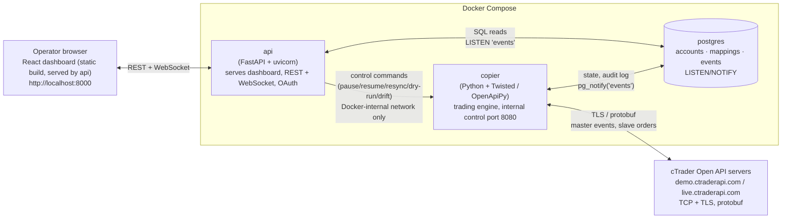

# Forex Copy-Trading System

Replicates every trade action from one **master** cTrader account to any number
of **slave** accounts at the same broker (FP Markets), in real time, over the
cTrader Open API. A web dashboard provides monitoring, control, account
onboarding, and a full audit log.

## 1. What this is

The system watches a single master trading account and mirrors its market
opens/closes (including partial closes), SL/TP changes, and pending order
lifecycle to a configurable list of slave accounts, each with its own
lot-size multiplier. It runs as four Docker Compose services: a Python/Twisted
**copier** that owns the cTrader connections and does the actual trade
replication, a **FastAPI** backend that serves the dashboard and proxies
control commands to the copier, **Postgres** as the single source of truth
for accounts, mappings, and the audit log, and a one-shot **migrate** job
that applies the schema on startup before `copier`/`api` start.



- **copier** — trading engine only. Owns the cTrader connections (one per
  environment needed: demo, live), heartbeats, reconnect with backoff, token
  refresh, master event subscription, slave order fan-out, and
  reconciliation. Writes every event/action/error to Postgres. Exposes a
  minimal internal HTTP control endpoint (Docker network only, port 8080,
  never published to the host) for pause/resume, resync, dry-run toggle, and
  drift-fix commands.
- **api** — FastAPI + uvicorn. Serves the dashboard's static build, the REST
  API, a WebSocket live feed (fed by Postgres `LISTEN/NOTIFY`), the OAuth
  redirect/callback for connecting cTrader IDs, and admin session auth.
  Forwards control commands to the copier's internal endpoint. The api being
  down never affects copying — the copier keeps trading independently.
- **postgres** — single source of truth: connected cTrader IDs (encrypted
  tokens), accounts and roles, symbol cache, position/order mappings, the
  append-only event log, global settings, and the admin user.

## 2. Prerequisite: register an Open API app

Before anything else, register an app at **https://openapi.ctrader.com**.
Spotware reviews applications manually, so do this first — it can take a
while and everything else in this README depends on the credentials it
issues.

- Describe the app honestly: **personal copy-trading across your own
  accounts**. That's what this system does — one master account you already
  trade, mirrored to slave accounts you also own.
- Set the **redirect URI** to `http://localhost:8000/api/oauth/callback` for
  local/demo use. When you move the stack to a VPS, update the redirect URI
  both in the cTrader app settings and in `CTRADER_REDIRECT_URI` in `.env` to
  match the VPS's public URL.
- Once approved, you receive a `clientId` and `clientSecret`. Keep these
  secret — they go into `.env`, never into git.

## 3. Setup

```bash
cp .env.example .env
```

Edit `.env` and fill in:

- `CTRADER_CLIENT_ID` / `CTRADER_CLIENT_SECRET` — from step 2 above.
- `FERNET_KEY` — the key used to encrypt OAuth tokens at rest. Generate one:

  ```bash
  python3 -c "from cryptography.fernet import Fernet; print(Fernet.generate_key().decode())"
  ```

  If your host Python doesn't have the `cryptography` package installed,
  either run it inside the copier venv after following the Development setup
  below (`copier/.venv/bin/python -c "from cryptography.fernet import Fernet; print(Fernet.generate_key().decode())"`),
  or use Docker with no local setup at all:

  ```bash
  docker run --rm python:3.12-slim sh -c "pip -q install cryptography && python -c \"from cryptography.fernet import Fernet; print(Fernet.generate_key().decode())\""
  ```

- `SESSION_SECRET` — any long random string (e.g. `python3 -c "import secrets; print(secrets.token_urlsafe(32))"`).
- `ADMIN_BOOTSTRAP_PASSWORD` — the password for the single dashboard admin
  user, set on first boot.
- `POSTGRES_PASSWORD` — the local default (`copytrader`) is fine for local
  use; change it before running on a VPS.

Then bring the stack up:

```bash
docker compose up -d --build
```

This builds and starts `postgres`, runs the `migrate` service to apply the
schema, then starts `copier` and `api`. With no `CTRADER_CLIENT_ID`/`SECRET`
configured yet (or with placeholder values), the copier idles safely — it
only errors if you try to actually connect accounts.

Open **http://localhost:8000**, log in with the `ADMIN_BOOTSTRAP_PASSWORD`
you set, then:

1. Go to **Accounts → Connect cTrader ID**. This opens the cTrader OAuth
   consent popup — no broker username or password is ever entered into this
   system. One OAuth grant covers **every trading account under that cTrader
   ID at the time you grant it**; if you add accounts to that cTID later,
   you'll need to re-grant (see Operations below).
2. You can revoke access at any time from your account settings at
   ctrader.com, independent of this system.
3. Once accounts are discovered, assign roles: exactly **one master**
   (enforced — the UI/API rejects a second), and any number of **slaves**,
   each with its own **multiplier** (slave lots = master lots × multiplier,
   default `1.0`).

## 4. Rollout stages (demo-first — do not skip)

Roll out gradually against **demo** accounts before touching anything live.
Each stage gates the next.

**Stage 1 — dry-run vs. a demo master.**
Assign a demo account as master, turn dry-run mode on, connect zero or more
demo slaves. Place manual trades directly in the cTrader platform (not
through this system) and confirm they appear in the dashboard's Logs screen
as master events, with `dry_run` "would-send" entries for what would have
been copied. This single step verifies two things at once: that manually
placed platform trades actually arrive over the Open API (undocumented by
Spotware, but expected — see spec §10.3), and gives you a first read on two
open unknowns: how many accounts you can authorize on one connection, and
whether there's any per-app aggregate rate limit beyond the documented
per-connection limit.

**Stage 2 — demo master → 2–3 demo slaves, dry-run off.**
Turn dry-run off and let copying run live against a small number of demo
slaves. Verify fills, partial closes, SL/TP propagation, pending order
place/modify/cancel, and that multipliers produce the expected slave volumes.

**Stage 3 — scale to your full demo slave count.**
Add the rest of your demo slaves. Exercise the operational controls before
trusting them with real money:
- the global kill switch (pauses all copying),
- per-slave pause,
- restarting the copier process (`docker compose restart copier`) while the
  master has open trades — trades made while the copier was down are
  **missed, not replayed**, and should surface as drift, never as a delayed
  copy,
- reconnect behavior after a restart,
- the drift remedies (close-orphan / adopt / dismiss) on whatever drift the
  restart produced.

**Stage 4 — live accounts.**
Only after stages 1–3 behave exactly as expected, connect real accounts.
Start with the smallest multiplier you can tolerate on your first live
slave, confirm a few real trades copy correctly, then scale up.

## 5. Operations

- **Kill switch** — a single global pause (Overview screen or `POST
  /api/control/pause` with no account id). It stops all copying immediately;
  resume with the matching resume control. It does not disconnect accounts
  or lose state — mappings and settings are untouched.
- **Per-slave pause** — pauses one slave account without affecting the
  master subscription or other slaves (`POST /api/control/pause` /
  `/resume` with an `account_id`).
- **Degraded slaves** — `degraded` is purely a transport/send problem, never
  a trading one. A slave is marked `degraded` only when a *send* to it
  exhausts its retry ladder (3 attempts, 1s/2s/4s backoff, for the
  pre-wire "never reached the broker" failure case) or hits a non-retryable,
  ambiguous send failure (the request's fate on the broker is unknown, so it
  isn't retried). Treat it as a connectivity issue: check the copier's
  connection health (`docker compose logs copier`) and the specific message
  in `last_error` on the Accounts screen. A degraded slave is not disabled —
  it keeps receiving every future master event (each action is
  independent) — and it clears automatically on its next successful send,
  or you can pause/resume it manually to force one.
- **Order rejected on a copy** — a separate, non-degrading path: the broker
  itself declines an individual copy order that *was* successfully sent —
  most commonly margin or below-minimum volume. The slave account stays
  `ok`; only that one mapping is marked `failed`, with the broker's reason
  visible as its `error` in the per-slave copy row on the Positions screen,
  plus a matching error-severity event in Logs. There is no account-level or
  Overview indicator for this case, so check Positions/Logs to catch it —
  the fix is usually funding or position-sizing on that slave account, not a
  copier restart.
- **Token refresh & re-grant** — the copier proactively refreshes each
  connected cTrader ID's OAuth token before it expires (access tokens last
  about 30 days, refresh tokens rotate on every refresh). If a token is
  invalidated out of band, cTrader sends a
  `ProtoOAAccountsTokenInvalidatedEvent`; the copier reacts by attempting an
  immediate refresh. If that refresh fails, the connection is marked
  `refresh_failed`: the Overview screen shows a prominent warning banner for
  it, and the underlying failure is also written as an error-severity event
  in Logs. Clear it by reconnecting that cTrader ID from **Accounts →
  Connect cTrader ID** (a normal re-grant, same OAuth flow as the first
  connection).
- **New accounts under an already-granted cTID** — a grant only covers the
  accounts that existed under that cTrader ID at grant time. If you open a
  new account under a cTID you've already connected, it won't show up until
  you re-grant (Connect cTrader ID again for that same cTID).
- **Backups** — all durable state lives in the `postgres` Docker volume
  (`pgdata`). Back that volume up (or the underlying Postgres data via
  `pg_dump`) on whatever schedule matches your risk tolerance; there is no
  other persistent state to capture.
- **Logs** — the dashboard's Logs screen is a live, filterable view (account,
  severity, category, date) over the append-only `events` table, streamed
  over WebSocket. For container/process-level logs (startup, connection
  errors, stack traces), use `docker compose logs`, e.g. `docker compose
  logs -f copier` or `docker compose logs -f api`.

## 6. Development

### Repo layout

```
copier/           Python/Twisted trading engine
  src/copier/     ctrader client, decision engine, dispatch, reconciliation, control HTTP endpoint
  tests/unit/     pure decision-core and component tests (no I/O)
  tests/integration/  fake cTrader server (TLS) + real Postgres
  .venv/          local virtualenv (not committed)
api/              FastAPI backend
  src/api/        routes (accounts, events, settings/control), auth, oauth, websocket feed
  tests/          route + auth + oauth tests against a real Postgres
  .venv/          local virtualenv (not committed)
dashboard/        React + Vite + TypeScript frontend
  src/pages/      Overview, Accounts, Positions, Logs, Login
  src/components/ shared UI (kill switch, layout)
db/
  migrations/     ordered .sql files, applied by the compose `migrate` service
  migrate.py      migration runner
docker-compose.yml
.env.example
```

### Per-service test commands

All commands below were run against this repo and pass. The `copier` and
`api` suites talk to a real Postgres, so start the compose `postgres`
service first (it publishes to `127.0.0.1:5433`, which is what both test
suites default to):

```bash
docker compose up -d postgres
```

**copier** (Python 3.12+; create the venv once with `python3 -m venv .venv
&& .venv/bin/pip install -e ".[dev]"` from inside `copier/`):

```bash
cd copier && .venv/bin/pytest tests --timeout=60
```

214 tests (unit + integration), takes roughly two minutes — most of that is
the integration suite, which spins up a real, self-signed-TLS, in-process
fake cTrader server (`copier/src/copier/testing/fake_server.py`) speaking
the same protobuf messages as the real API (auth, heartbeats, order
placement, fills, rejections, disconnects) and drives the real SDK client
against it. Nothing here talks to the real cTrader network.

**api** (Python 3.12+; create the venv once the same way, from inside
`api/`):

```bash
cd api && .venv/bin/pytest tests
```

75 tests. Uses the same Postgres instance (a fresh `copytrader_test`
database, dropped and recreated per session) and a mocked HTTP transport for
any outbound calls to cTrader's OAuth token endpoint — no real network calls.

**dashboard** (Node 22+; `npm install` once from inside `dashboard/`):

```bash
cd dashboard && npm test
```

Runs `tsc --noEmit` (typecheck) followed by `vitest run`. 7 test files, 36
tests, all component/page tests with mocked `fetch`/WebSocket — no backend
required.

When you're done, tear Postgres back down: `docker compose down -v`.

### Fake-server / end-to-end testing

`copier/tests/integration/` is the closest thing to an end-to-end test
without touching the real cTrader API: `FakeCTraderServer` (in
`copier/src/copier/testing/fake_server.py`) listens on a random local TLS
port using a self-signed cert generated in-process
(`copier/src/copier/testing/tls.py`), and the real `ctrader-open-api` SDK
client connects to it exactly as it would to `demo.ctraderapi.com`. Tests
exercise account auth, heartbeats, order placement and fills, rejections,
disconnects, and reconnection — see `test_client_integration.py`,
`test_fake_server.py`, and `test_symbols.py`. To add a new integration
scenario, extend `FakeCTraderServer`'s handlers rather than mocking the SDK
directly, so the test still exercises the real wire protocol.

For a true end-to-end check against Spotware's infrastructure, there's no
substitute for the demo-account rollout stages in section 4 above — that's
the only place this system talks to the real cTrader Open API before going
live.
